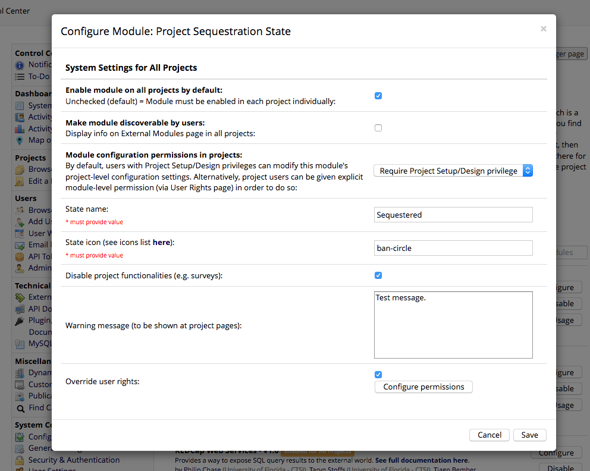
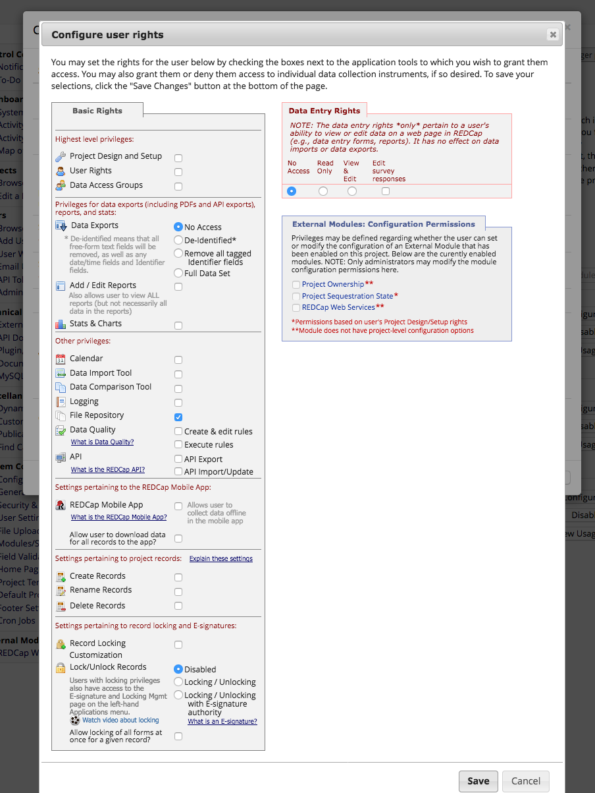
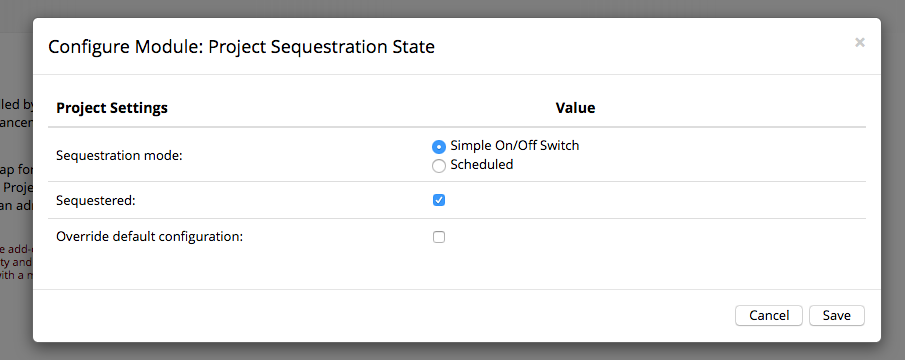
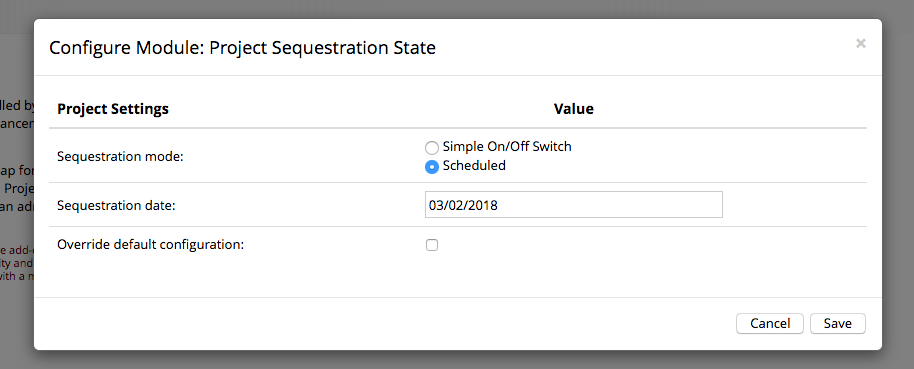
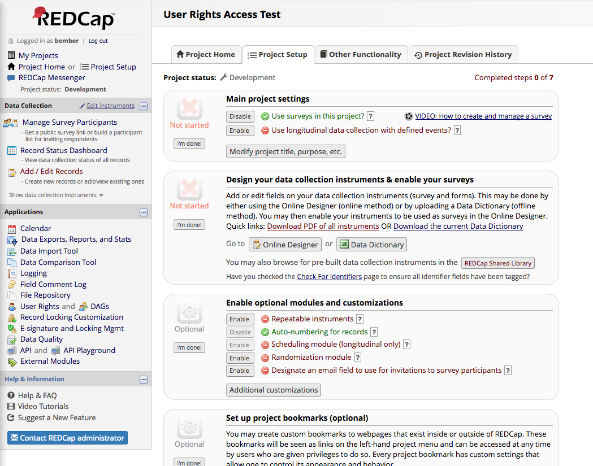
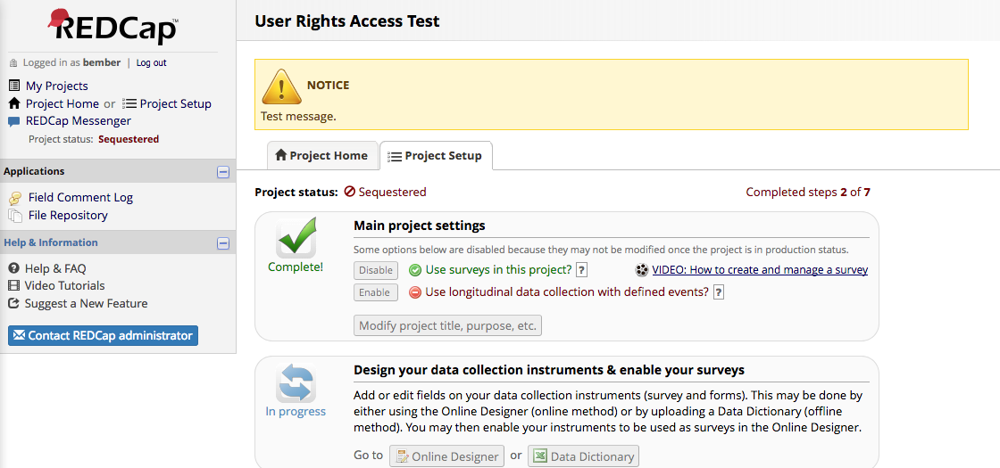
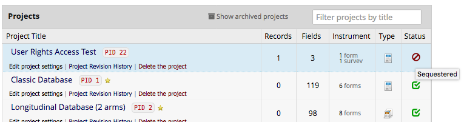
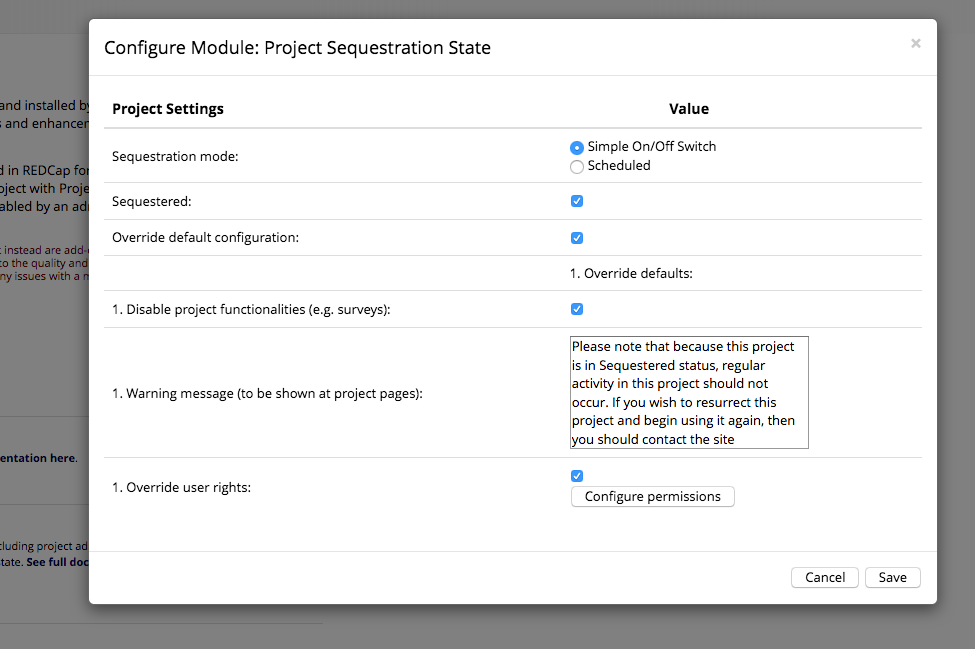

# REDCap Project Sequestration State (PSS)
Provides REDCap global admins a new project state that "sequesters" access from local users - including project administrators. A Sequestered project is different from Archived or Inactive ones since project admins don't have any control over this new state.

## Prerequisites
- REDCap >= 8.0.3

## Installation
- Clone this repo into `<redcap-root>/modules/project_sequestration_state_v<version_number>`.
- Go to **Control Center > Manage External Modules** and enable Project Sequestration State.

## Configuration
Access PSS configuration on Control Center in order to set the following fields:

* __State name, State icon:__ These fields define how the sequestered state will present itself to the users (label and icon). A [link to a list of icons from Bootstrap](https://getbootstrap.com/docs/3.3/components/) is provided.
* __Disable project functionalities:__ If checked, once a project enters in sequestered state, it behaves like a Inactive one, so all basic functionalities - like public surveys - will be disabled.
* __Warning message:__ The message displayed when a sequestered project is accessed, which can be useful when users are required take some action. Leave it blank to do not display any message.
* __Override user rights:__ If checked, a button shows up that leads to a user rights configuration screen, very similar to REDCap's user role edit screen (see image below).

## Sequestrating a project
To sequestrate a project, go to your project, open SPP configuration modal, and then you will find 2 ways to sequester the project: _Simple On/Off switch_ and _Scheduled_, as it's shown on images below.

## Effects of project sequestration

The configuration example from previous sections results in the following view for a regular user. Note that the permissions became limited - only File Repository is acessible due to the user rights configuration. Note also the warning message at the top of page, plus the project status label & icon.

### Before sequestration

### After sequestration

### Project lists

The project status name & icon on is also changed on project lists, as in the example below.

## Overriding global configuration per project

It is possible to override the global configuration by checking __Override default configuration__ checkbox and filling the fields that show up, which are exactly the same found on global configuration.

